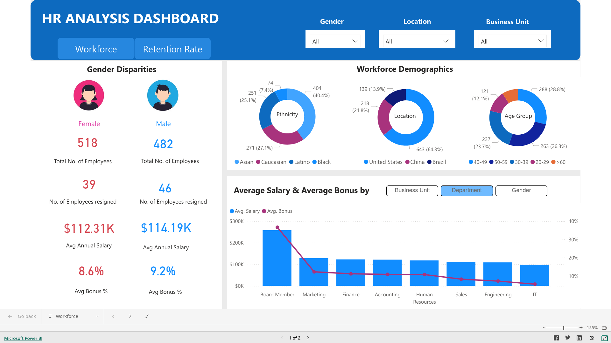
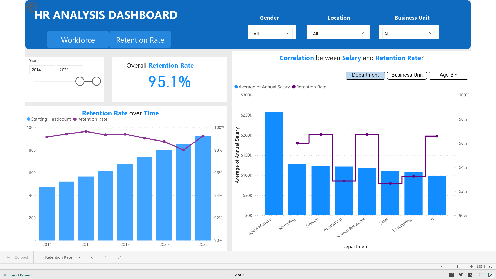
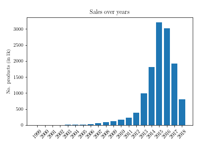
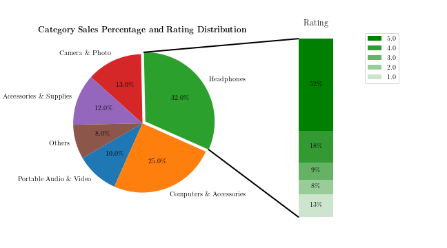

# Portfolio Projects

## About Me

I am a master's graduate with a passion for analyzing and interpreting large datasets to uncover insights and improve business performance. 

I have experience working in both the index and software industries, where I honed my skills in data analysis and visualization. I am skilled in programming languages such as Python and SQL, with a strong background in Power BI.

I am deeply passionate about using data to drive decision-making and am always seeking new challenges and opportunities to learn and grow. My portfolio showcases my proficiency in Power BI and highlights my ability to effectively communicate complex data visually.

## [Project 1: HR Data Analysis using PowerBI](https://app.powerbi.com/view?r=eyJrIjoiZGUwZDFkZWMtMjY1ZS00MjdiLTkxYWUtMzk5MDRlOGExMTk3IiwidCI6IjRkMGQyNmU3LTM2OWEtNDFhYi1iNzgyLWQwOTgwMTFlYTEzNiIsImMiOjEwfQ%3D%3D)

[Link to view my report](https://app.powerbi.com/view?r=eyJrIjoiZGUwZDFkZWMtMjY1ZS00MjdiLTkxYWUtMzk5MDRlOGExMTk3IiwidCI6IjRkMGQyNmU3LTM2OWEtNDFhYi1iNzgyLWQwOTgwMTFlYTEzNiIsImMiOjEwfQ%3D%3D)

Below is the HR data analysis report summary. In this overview, I've examined a Human Resources dataset provided by [Zoomcharts - Drill Down Visuals for Power BI - Turn your reports into interactive experience](https://zoomcharts.com/en/microsoft-power-bi-custom-visuals/challenges/), presenting key insights from the HR Data Analysis dashboard.

Data sheet is accessed on May $16^{th}$ 2024 and cloned to my project [here](https://github.com/vutrang1808/vutrang1808/blob/main/data/HR_Data_Analysis_English.xlsx).

**Page 1**

**Page 2**

### 1. Employee Diversity

The company's workforce displays diversity in gender and ethnicity. Females slightly outnumber males, comprising 518 individuals compared to 482 males. Asian employees constitute the largest ethnic group at 404, followed by Caucasian (271), Latino (251), and Black (74). Given that 64.3% of the workforce is based in the United States, this country appears to be a significant market focus for the company.

### 2.  Age Distribution

A substantial portion of the company's workforce falls within the 40-49 age bracket, numbering 288 individuals. This is followed by the 50-59 (263) and 30-39 (237) age groups. Only around 12% of the workforce is aged 20-29, suggesting a mature and experienced employee base. This demographic composition may influence strategies related to training and succession planning.

### 3. Average Annual Salary

Gender-wise, average annual salaries are closely aligned, with males earning slightly more ($114K) than females ($112K). However, between 2017 and 2022, the average income of females increased to $114K, surpassing that of males, which decreased to $111K. Potential reasons for this shift include higher turnover among males, increased promotion opportunities for females, or salary adjustments during the period.

There's notable disparity in salary ranges for board members, with the highest average annual salary reaching $256,561, nearly four times higher than the lowest. This indicates significant pay variations based on factors such as experience, location, or performance. Additionally, system administrators tend to earn more than their network counterparts across all departments.

### 4. Retention Rate

The retention rate fluctuates over time but generally remains above 98\%, suggesting high overall employee satisfaction or effective retention strategies. A notable decrease occurred in 2020-2021, likely influenced by the COVID-19 pandemic's impact on the labor market, followed by a strong rebound in 2022.

While higher-paid areas generally exhibit higher retention rates, this trend does not consistently apply across all job titles. This highlights the need for a more detailed workforce analysis to tailor HR strategies beyond monetary aspects.

## [Project 2: Data Analysis using Python, pandas, and SQL](https://github.com/vutrang1808/amazon_electronic_products_sales)

This notebook demonstrates two approaches for a comprehensive sales analysis of an Amazon electronics products dataset with dimensions 1.3M x 10.
The first approach utilizes Pandas DataFram and the second approach is based on SQL.

The analysis aims to address the following questions:
- What are the categories of electronic products?
- Find the Top-10 users that bought the most in each category.
- Analyze sales in a certain year, grouped by categories.
- Given a brand, identify the categories in which it has products.
- Determine the categories with the highest market competition.

### **1. DataFrame-based Approach**

A systematic approach is followed throughout my analysis, with each step accompanied by insights into the dataset: 
- **Data Cleaning:** 
Data cleaning involved scanning the input dataset to identify columns where NaN values occupy the majority of rows.
These columns were deemed unlikely to provide meaningful insights and were thus ignored in further analysis.

- **Handling Timestamp:**
Due to inconsistencies between the timestamp and year columns, the timestamp (including the date) is chosen as the reference time for each purchase.

- **Data Processing:**
The solution is implemented in `Python`, utilizing `Pandas` for data manipulation and `Matplotlib` for visualization.

### **Dataset Details**

The dataset encompasses Amazon electronics sales data spanning from 1999 to 2018. It is available on [Kaggle](https://www.kaggle.com/datasets/edusanketdk/electronics/data).

### **Analysis and Insights**
By addressing the following queries, insights into various aspects of the input dataset are gained:

- **Categories of Electronic Products:**
        Identified the unique categories of products available in the dataset.

- **Top-10 Users per Category:**
        Determined the top 10 users who purchased the most in each category.

- **Yearly Sales Grouped by Categories:**
        Analyzed and visualized sales data for specific years, grouped by product categories.

- **Brand-wise Product Categories:**
        For each brand, identified the categories in which its products are listed.

- **Market Competition Analysis:**
        Determined which categories have the highest market competition based on the number of unique brands.

### **2. SQL-based Approach**
This script `sql_based_approach.ipynb` demonstrates an approach that leverages a structured database schema using SQL for the data analysis task. 
MySQL is chosen as the underlying DBMS.

## [Project 3: Financial Modeling with Microsoft Excel](https://github.com/vutrang1808/excel_financial_modeling)

### Purpose:
This project is designed to develop and solidify financial modeling concepts using Microsoft Excel. It offers a step-by-step guide to constructing an integrated financial model, aligned with a company’s investment planning process.

### Overview:
The Excel-based tools developed in this project will guide users through the process of planning and analyzing a company investment, covering key financial metrics and statistical methods. The model includes the following key components:
1. Historical Data Analysis
2. Scenario Analysis
3. Linear Regression Analysis
4. Cash Flow Modeling
5. Simulation

### Key Learning Outcomes:
 - Identify growth drivers from historical data using Excel.
 - Apply discounted cash flow (DCF) analysis for investment evaluation.
 - Implement Monte Carlo simulations to derive key financial assumptions.
 - Develop detailed asset and debt schedule models in Excel.
 - Leverage advanced features of Excel for financial analysis.
 - Calculate profitability ratios using various profit metrics.

My solution details are given in the [attached Excel sheet](https://github.com/vutrang1808/excel_financial_modeling/blob/main/Project_Vu.xlsm). 
